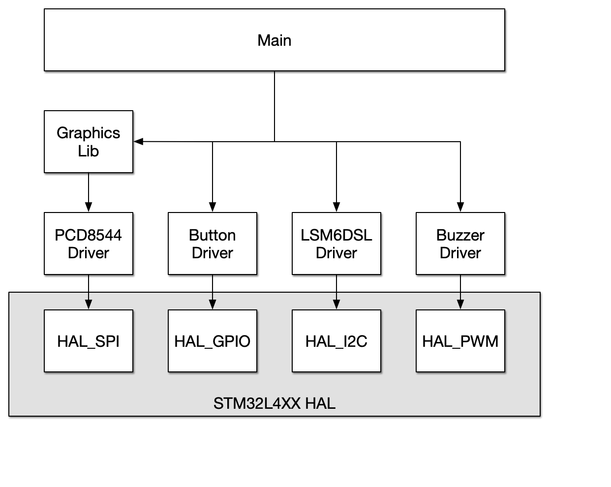

# Application Description

This final project is a desktop [Pomodoro timer](https://francescocirillo.com/pages/pomodoro-technique).
It consists of a triangular-shaped digital desktop timer that has some allowances for using the Pomodoro Technique.
The timer is orientation sensitive, allowing you to select a duration by how you place it down on the desk.
Using the accelerometer, the timer determines if you've selected a _Pomodoro_ (25 minutes), a _short break_ (5 minutes), or a _long break_ (15 minutes).
These correspond to the typical durations used the Pomodoro Technique.

The technique, briefly:

1. Start a 25 minute timer.
   During this time focus entirely on the task at hand.
   Postpone any interruptions until the timer has expired.
2. Take a short, 5 minute break.
3. Repeat 1 & 2 three more times.
4. After the fourth Pomodoro, take a longer break (15 minutes).
5. Repeat 1 through 4 as needed to accomplish your tasks.

The timer will keep track of the total number of Pomodoros that you've accomplished.
There is a reset button to clear the accumulated count of Pomodoros.
Good work today!

# Hardware description

The main component parts are listed here and then discussed briefly below:

- STM32L4 Discovery kit, B-L475E-IOT01A. This board features an STM32L475VGT6 MCU.
- Philips PCD8544 48 × 84 pixels matrix LCD
- ST LSM6DSL, 3D accelerometer and 3D gyroscope (on-board)
- Push button (onboard)
- UART (onboard)

The main piece of hardware is an STM32L4 Discovery kit (B-L475E-IOT01A).
This is a very capable processor and I'm only using a small portion of what it can really do.
Some of the implications of this are also discussed in the "Future" section below.

There is an external LCD screen, a Philips PCD8544 (aka the old Nokia phone screen).
This is connected via SPI1 on the MCU.
Pins were assigned and configured semi-automatically using the STM32CubeIDE's device configuration wizard.
Basically I chose to enable "SPI" and then the wizard picked the pins and set them to their appropriate functions.

The 3D accelerometer, LSM6DSL.
This is an on-board peripheral with the STM32L4 Discovery board.
It's connected to the chip via I2C.

The push button is the built-in blue "USER" button on the Discovery board.
It is configured to generate an interrupt that jumps out of the current state, and resets the state machine to start.
The count of pomodoros is not changed, however.

The onboard UART is used for debugging so far.
I was also able to use the LCD display once I had bootrapped drawing letters, numbers and strings.
This turned out to be really useful and had the side benefit that I was eating my own dogfood early on.

# Software description
The software is generally layered so that the main application code uses drivers (written by me or adapted from elsewhere).
The drivers in turn depend on the STM32 HAL.
For example, to draw graphics on the screen I've written a drawing library that depends on the LCD driver, and then that depends on HAL SPI functions.
The drawing library only needs to know how to place pixels in an abstract (x, y) grid; it has functions like `drawCircle` & etc.
The LCD driver, in turn has functions like `LCD_drawPixel`, and `LCD_display`.
These write the pixel into a buffer and then actually send that buffer to the display, respectively.
The LCD driver is fairly self-contained, but depends on HAL functions to talk SPI and wiggle some GPIOs.

I used the Adafruit PCD8544 LCD C++ code and adapted/ported it to: first use the STM32 HAL, and second write it in C.
This was a short module and I also discarded a lot of the generality that the Adafruit code had.
For instance, I knew that I was going to be working with a hardware SPI device.
Not all the functions from the Adafruit code were needed, and so I omitted many of them.

I also used the Adafruit libraries pretty extensively as references when writing the graphics routines.
The circle and line-drawing algorithms are ultimately due to Bresenham.
I didn't end up using the some of the graphics routines that I had been working on.
I wanted to draw a circular clock graphic that would show a slowly growing or shrinking pie piece to indicate time left in your current session.
Mainly, I just ran out of time here.

The state machine became larger than I thought it would be initially.
There's probably a way to refactor this so that there are entry and exit events from most states.
I found that it was often convenient, from a software point of view, to have a greater number of fleeting states that are there to clean up or reset values.
The divide is that there are some things that I want to do just once and then there are things that I want to poll.
In the `WAIT` state, for instance, I want to keep checking the accelerometer to see if the orientation has changed.
But I don't need to continually clear and then update the display in this state.

# Diagram(s) of the architecture

_Hardware component diagram_

_Software component diagram_

# Build instructions
After some brief experimentation with a standalone Makefile and later the online ARM Mbed platform, I decided to go with STM32CubeIDE.
Building the project should be straightforward.
You can open the code as an existing STM32CubeIDE project and then build.
The IDE ".ioc" config file contains, among lots of other project-specific stuff, the board used.
Everything should _just work_ as long as you're familiar with Eclipse-based IDEs.

For debugging, I've used the IDE extensively.
It is very helpful to be able to make some changes, build the code, and launch the new code on the board within a few seconds.
Though Eclipse is a little clunky, I've been able to pretty easily view variables, evaluate expressions, and step through the code as it runs on the board.
Early on, I found that I had to check to see that all my SPI signals were wired correctly.
Here I was able to use an oscilloscope to confirm that the _clock_, _MOSI_, and _chip select_ lines were actually getting to the LCD.
I compared a single-shot trace triggered on _chip select_ line to the LCD datasheet to see that the correct pattern was being sent.

On the hardware side, I've prototyped everything on the STM32L4 Discovery board.
The external LCD screen is connected with jumper wires from the LCD to the the Arduino-compatible headers on the Discovery board.
The speaker and the reset push button are external to the board as well.

# Future
To make this prototype more usable as a production device, I'd first look at its power requirements.
I'd expect something like this to have a pretty extensive battery life.
I would have investigate the various sleep modes and if I could keep the timer mostly asleep between ticks.
The case could also be improved for a more refined look.
I imagine a middle-ground could be a 3-d printed enclosure to get dimension and fit just right.

Another like of enhancement would be to _IoT-it-up!_
This timer is just _asking_ for a phone app to automatically accumulate and categorize pomodoros.
The board has both Wi-Fi as well as Bluetooth so I'd have my choice of connectivity.
I have done lots of web application development but very little native app development.
Initially then, I'd lead toward using web technologies.
The timer could automatically upload to a website for tracking time.
It could also be possible to control the timer by sending GET and POST HTTP requests in order to configure the timer.

Alternatively, a future direction could be to slim everything down.
It should be possible to implement the same features on a cheaper board or even to design a custom PCB that included the external accelerometer.
It would be nice for the new chip to have hardware support for I2C, SPI and PWM.
These are widely-supported peripherals, and are typically available even on lower-end devices.
