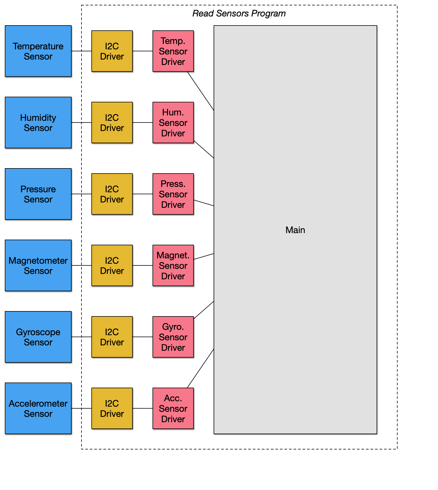

# Exercise 2.1

## Idea project diagram

> Make a block diagram describing an embedded system you’d like to have or make.
> Be imaginative. Reality does not apply here.

# Exercise 2.2

## ARM Mbed template project block diagram

> Create a block diagram for this program, briefly explain why you chose the
> platform and template you did, be prepared to talk about this board in Live
> Class

I chose the _DISCO-L475VG-IOT01A (B-L475E-IOT01A)_ platform aka _STM32L4
Discovery kit IoT node_. The example template that I chose is the _read sensors_
program.

I chose this combination of platform and template because I'm hoping to use this
board on my final project. The template program includes sample code for how to
use the accelerometer. I'm planning on making a timer that will be partly
controlled by how the board is oriented (i.e. which way is down).

