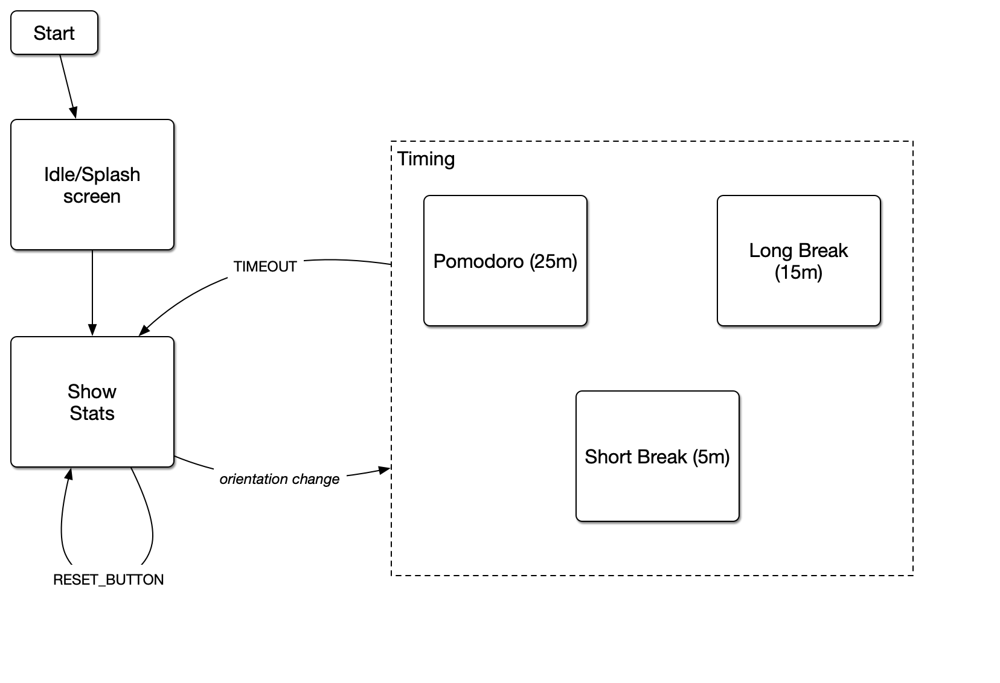

# Week 5, Final Project Planning

> Start putting together a plan for your final project. Given the
> chapter, the main goal is to put together state machine
> documentation. This can be a flowchart or (preferably) a state
> table. You may also need to create the diagrams from Lesson 2 to
> flesh out the design. Note: this design planning, thinking through
> the system, what you have and what you need. Keep in mind that these
> will not be the final version!

## State Diagram

## State Table

| State                | Event                    | Next                 | state State var: pomodoros |
|----------------------|--------------------------|----------------------|----------------------------|
| START                | [NONE]                   | SHOW_STATS           | pomodoros = 0              |
| SHOW\_STATS          | orientation: pomodoro    | TIMING\_POMODORO     |                            |
| SHOW\_STATS          | orientation: short break | TIMING\_SHORT\_BREAK |                            |
| SHOW\_STATS          | orientation: long break  | TIMING\_LONG\_BREAK  |                            |
| TIMING\_POMODORO     | timeout (25 min)         | SHOW\_STATS          | pomodoros++                |
| TIMING\_SHORT\_BREAK | timeout (5 min)          | SHOW\_STATS          |                            |
| TIMING\_LONG\_BREAK  | timeout (15 min)         | SHOW\_STATS          |                            |
| TIMING\_LONG\_BREAK  | timeout (15 min)         | SHOW\_STATS          |                            |
| [ANY]                | reset button             | SHOW\_STATS          | pomodoros = 0              |
