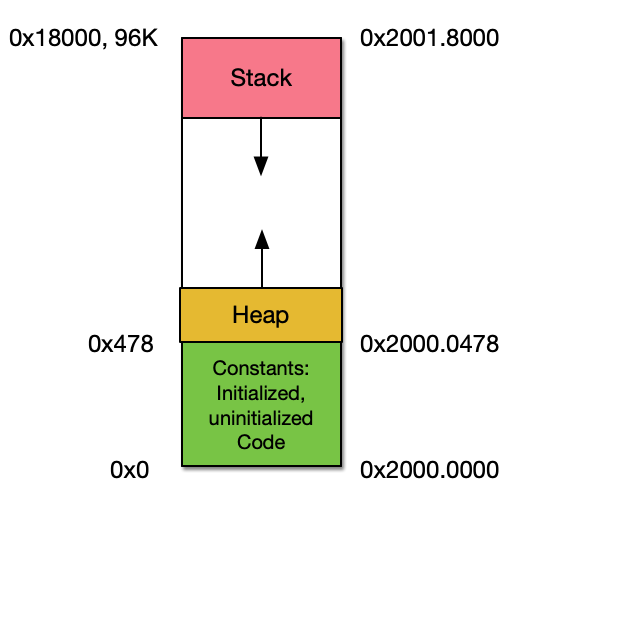

# Week 8, Heap, Stack, and Globals

> Compile your project code so it prints out the heap pointer and the
> stack pointer. Print out a global variable address. If you can find
> it, modify your linker file to swap your uninitialized variables and
> initialized variables. Verify it is as expected in the memory
> map. See how that changes your code output.

The end of RAM-type memory (origin RAM + length RAM)
origin RAM  = 0x20000000 (listed in linker file)
length RAM  = 0x00018000 (listed in linker file, 96K)

\_estack    = 0x20018000 (listed in map file)
\_end       = 0x20000478 (listed in map file)

Heap pointer:
Stack pointer:
Global address:

